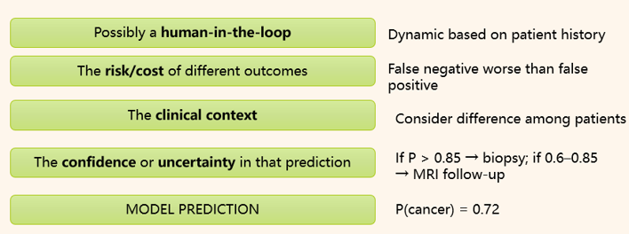

####  Enhancing Transparency and Safety in Medical AI through Model Calibration and Uncertainty decision Modeling

Project abstract: 
This project aims to investigate methods for improving the safety, transparency, and trustworthiness of machine learning models in healthcare applications. While deep learning has shown remarkable performance in tasks such as medical imaging and diagnosis, clinicians often hesitate to rely on these models due to their “black-box” nature and lack of calibrated confidence. The project will focus on two aspects: (1) Model Calibration — applying cutting-edge machine learning calibration methods to overcome the model over-confidential predictions and reduce model uncertainties  (test-time data augmentation, and calibration methods like Platt scaling). (2) Risk-aware decision process  — there is a gap from model outcomes to final doctor decisions. Risk-aware decision making is a framework where decisions are made not just based on predicted outcomes, but also by explicitly accounting for the uncertainty and potential consequences (risks) of those outcomes.  A possible consideration flow is like below: 

# Project Structure 

medical_ai_safety/
│── data/                # Sample training & test data  
│── notebooks/           # Jupyter notebooks for exploration & experiments
│── src/                 
│   ├── models/          # Current no file
│   ├── pipelines/       # Current no file
│   └── monitoring/      # Current no file 
│── tests/               # Unit and integration tests
│── requirements.txt     # Python dependencies
│── README.md            # Project description
│── LICENSE              # License file

